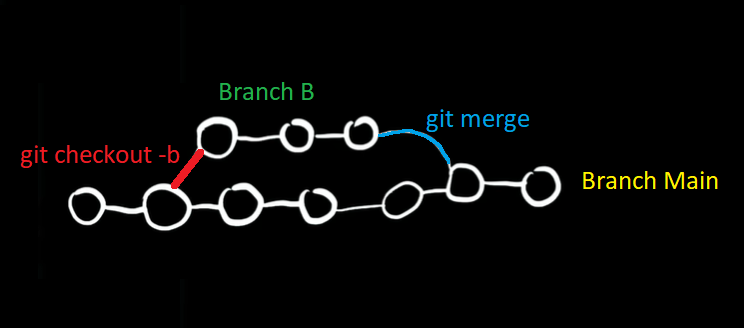

# GIT: Comandos Básicos y generalidades [(fuente)](https://www.youtube.com/watch?v=VdGzPZ31ts8&t=2485s "GIT con Hola Mundo")

 

  Este documento tiene como finalidad ser un refresca-memoria sobre el uso general de GIT y Github, el mismo se inspira y toma el esqueleto narrativo del video que realizó Nicolas Schurmann del canal "Hola Mundo", aunque tambien toma elementos de Juan Diaz del canal Pildoras Informaticas. A medida que se vaya completando se iran citando las fuentes correspondientes. Este documento no tiene fines lucrativos.

 

### Configuración Inicial:
 

1. git config --global user.email  email@generico.com (Configura Mail)

2.  git config --global user.name "Nombre generico" (Configura nombre de usuario).

3.  git config --global core.editor "`rutadel .exe del editor´ -w" (Configura editor predet).

4.  git config --global core.autocrlf "true/input" (Poner  True en Windows, Input en Mac y Linux).

5.  git config --list (muestra configuración en Consola, se puede hacer tambien con "git config --global -e" y muestra la configuración en editor predet ).

6. git config -h (listado de configuraciones posibles, leer para ampliar).

 

### Navegación por directorios, etc:

 

* pwd : Muestra directorio en el que se encuentra Git Bash.

* ls : Muestra los sub-directorios **visibles** en el directorio. para mostrar los directorios ocultos usar "ls -a"

* cd : avanzar/retroceder a traves de los directorios.

* mkdir : Comando para crear directorio. Por ejemplo: "mkdir CarpetaGenerica" crea una subcarpeta en el directorio actual con el nombre "CarpetaGenerica".

 

### Flujo de trabajo, Creación de repositorio, Stage, Commmit, etc:

 

____

 Los cambios en el desarrollo de un proyecto pasan por 4 etapas: Computador, Stage, Commit y Servidor (En nuestro caso GIT HUB).
 
 Todo cambio, incluido las deleciones de ficheros deben ser comprometidas para verse reflejados en el repositorio.
 ___

 

* git init : Crea un repositorio del proyecto, en este proceso se crea una carpeta oculta en el directorio .git, la cual es una carpeta de implementación.

* git status : Muestra el estado de todos los cambios realizados en el directorio que se encuentren en estapas previas a Commit. Tiene una forma más elegante "git status -s" es una forma más simplificada visualmente.

* git add . : Agrega **todos** los cambios a una etapa de Stage, esto es una mala practica, es recomendable agregar cambios individualmente (Es decir, sin el punto, sino con el nombre del fichero). 

* git commit  : Compromete los cambios realizados en el fichero que se encuentren en una etapa de Stage. Los commit deberian tener un mensaje que sea descriptivo de los cambios realizados, para una mejor comprensión. Se puede usar "git commit -m "descripción del cambio" " para hacerlo desde Gitbash y no desde el editor predet.

* rm Archivo.txt : Elimina Archivo.txt de la carpeta, pero no del repositorio, para lo cual la deleción deberia Adicionarse y comprometerse.

* git rm Archivo.txt  : Con esto me ahorro la etapa de Stage al eliminar un fichero, sólo tendría que comprometer el cambio en Archivo.txt para hacer efectivo el cambio

* git mv Archivo.txt Archivo1.txt
 : renombra el Archivo.txt en Archivo1.txt y lo adhiere a la etapa Stage en un sólo paso.

* git recover --stage Archivo.txt
 : Saca la deleción de archivo.txt de la etapa de stage, pero esto no recupera el archivo.

* git recover Archivo.txt
 : Este comando recupera Archivo.txt

 
 

### Ignorar archivos:

 

___ 

Esta funcionalidad de GIT es muy importante ya que evita que, por error, se suba al repositorio directorios y ficheros que, por su naturaleza no queremos que lo hagan. 

Por ejemplo archivos de configuración local, variables de entorno configurables (.env) o bases de datos almacenadas en local durante el desarrollo,  que almacenan contraseñas e información privada de cara al usuario final, poniendo en riesgo la seguridad.
____

 

* Para ignorar un fichero (Por ejem Archivo.env), o  directorio (por ejemplo CarpetaGenerica) se debe seguir el siguiente procedimiento:

    1. Crear en el editor un archivo .gitignore y especificar dentro de él la carpeta, ruta o fichero que debe ser ignorado, por ejemplo:

        Archivo.env

        CarpetaGenerica/

    2. El paso anterior ignora CarpetaGenerica y Archivo.env en la terminal de GitBash, sólo resta agregar y comprometer el archivo .gitignore.

 

 

### Visualizacion de Historial y modificaciones:

 

* git diff
 : Permite visualizar todos los cambios realizados en los ficheros, hay una forma alternativa "git diff --staged" para ver solamente los cambios en la etapa de Stage. Se usa ´q´ para salir del comando en consola.

* git log
 : Permite visualizar el historial de cambios que fueron "commiteados", figura el correo y usuario que realizó el cambio, se puede usar la versión simplificada que es "git log --oneline"

 

 

### Ramas (Branches):

 

 

 

En git se pueden crear  [comando : git checkout -b Branch B]  bifurcaciones "ramas" o "branches" sobre las que cada progrmador puede trabajar independientemente sin modificar la rama principal "Main" o "master", y puede, posteriormente si asi lo desea hacer un " git merge Branch B" para fusionar los cambios a la rama principal. (Es importante haber cambiado antes a la rama main con el comando " git checkout Main" para poder indicar que se desea fusionar Branch B a la rama Main)
